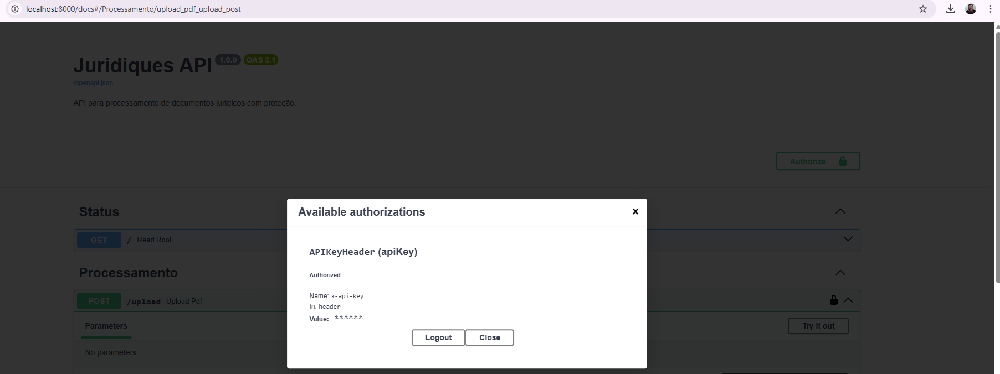
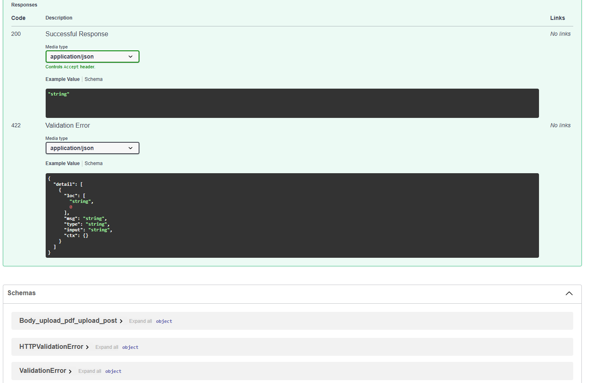

# ⚖️ API Juridiques Zero

Uma solução inteligente para desmistificar o "juridiquês", automatizando a extração de dados críticos e a análise de documentos judiciais.

## 🚀 Sobre o Projeto
Esta API foi desenvolvida para transformar documentos jurídicos complexos em informações acionáveis. Utilizando a arquitetura moderna do FastAPI e PyMuPDF, ela garante precisão na leitura de metadados e textos de processos.

---

## 📸 Demonstração do Ambiente

### 🐳 Gerenciamento de Infraestrutura (Docker)
Monitoramento dos containers via Docker Desktop, garantindo o controle de recursos como CPU e Memória.
<div align="center">
  
</div>

<br>

### ⚡ Interface de Testes (Swagger UI)
Documentação interativa da API para upload de PDFs e validação da `x-api-key`.
<div align="center">
  
</div>

<br>

### 🔍 Processamento e Logs
Visualização detalhada da extração de dados e logs de execução do servidor.
<div align="center">
  
  
  
</div>

---

## 📦 Como Instalar e Rodar

1. **Build da Imagem:**
   ```bash
   docker build -t juridiques-api .
   ```

2. **Execução do Container:**
   ```bash
   docker run -d -p 8000:8000 --name juridiques-container juridiques-api
   ```

---
Desenvolvido por [Liucera](https://github.com/Liucera)
