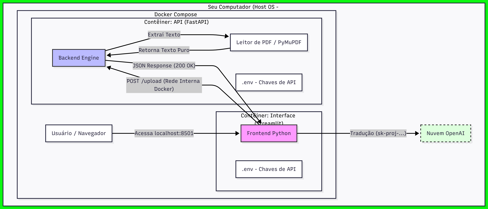
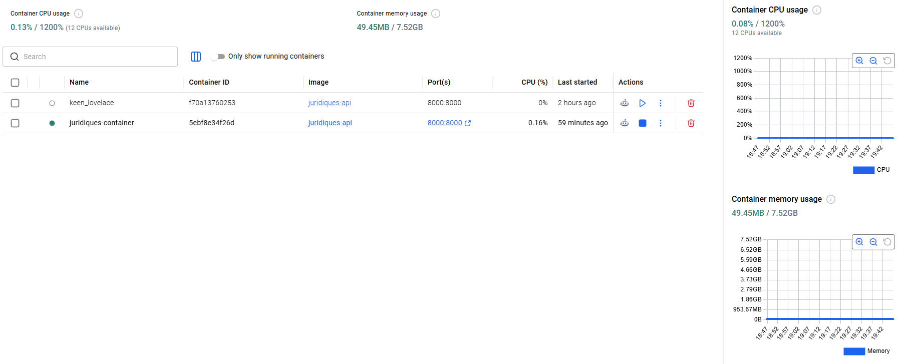
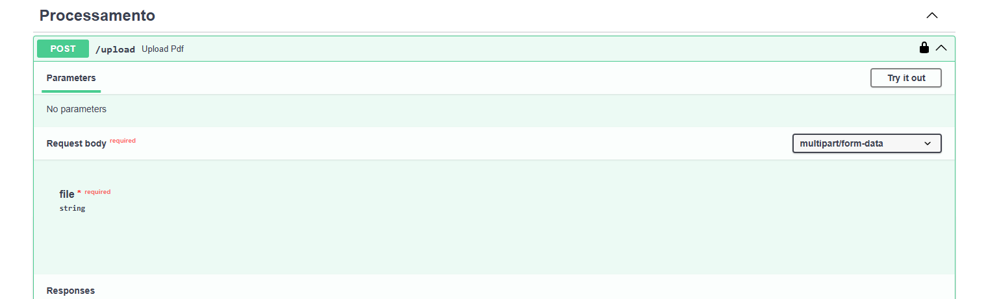
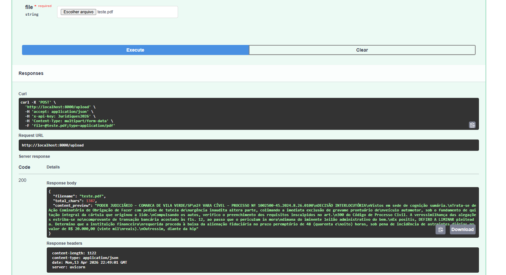

# ⚖️ Juridiques Zero - Arquitetura Conteinerizada

Este projeto evoluiu de uma aplicação simples para uma arquitetura de microserviços utilizando Docker, permitindo o provisionamento rápido, isolado e profissional de todo o ecossistema.

---

## 🏗️ Arquitetura do Sistema e Explicação Técnica
Baseado no diagrama técnico do projeto, aqui está a decomposição da nossa infraestrutura:

### 1. O Host (WSL2 + Docker Compose)
A camada principal isola os serviços do sistema operacional hospedeiro. Isso garante que o projeto rode identicamente em qualquer ambiente, seja no seu computador ou em um servidor AWS.

### 2. Orquestração de Microserviços
* **Contêiner API (O Cérebro):** Especialista em logística de dados. Utiliza a biblioteca **PyMuPDF** para extrair texto de PDFs e converter em dados estruturados (JSON).
* **Contêiner Interface (A Vitrine):** Gerencia a interação visual e o upload de documentos via Streamlit.

### 3. Rede Interna e Service Discovery
Em vez de endereços IP fixos (127.0.0.1), os contêineres comunicam-se pelo nome de serviço (`http://api:8000`). Isso simula a arquitetura de grandes centros de dados modernos.

### 4. Segurança de Nuvem (.env)
As chaves de API não ficam expostas no código. Elas são injetadas via variáveis de ambiente pelo Docker, seguindo o "padrão ouro" de segurança em Cloud Computing.

---

## 📸 Galeria de Evolução: Do Zero ao Cloud

Nesta galeria, registramos a jornada de desenvolvimento do projeto, saindo dos testes iniciais de extração até a interface final.

  
  
  
  
  

### Explicação do Processo Anterior
Antes da implementação do Docker Compose, o projeto operava de forma monolítica. A evolução capturada nas imagens acima mostra:
1.  **Validação de Metadados:** A transição da leitura bruta de PDF para a extração inteligente.
2.  **Segurança de Header:** Implementação da `x-api-key` para proteção de endpoints.
3.  **Logs em Tempo Real:** Monitoramento da comunicação entre o motor de extração e a interface de usuário.

---

## 📂 Documentação Oficial
Para uma imersão completa nos detalhes técnicos e de provisionamento, acesse o manual em PDF:
📄 **[Manual Técnico do Projeto (PDF)](./docs/explicacaodiagrama.pdf)**

---

## 🚀 Como Executar
1. `git clone https://github.com/Liucera/API-JURIDIQUES-ZERO.git`
2. Configure seu arquivo `.env` com a `OPENAI_API_KEY`.
3. Rode o comando: `docker-compose up --build`
