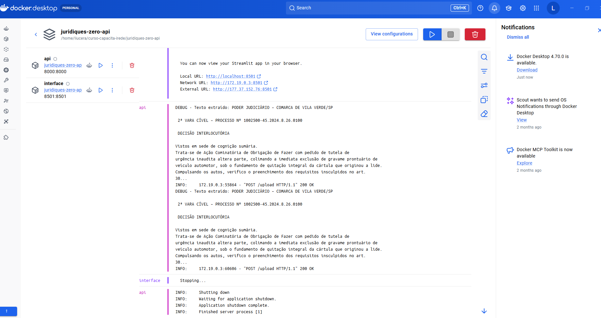

# ⚖️ Juridiques Zero - Arquitetura Conteinerizada

Este projeto foi evoluído para uma arquitetura de microserviços utilizando Docker, permitindo o provisionamento rápido e isolado de todo o ecossistema.

## 🏗️ Arquitetura do Sistema
O sistema foi desenhado para rodar em contêineres separados, garantindo escalabilidade e segurança:
* **API Backend (FastAPI)**: Responsável pelo motor de extração de dados e processamento de PDFs.
* **Interface Frontend (Streamlit)**: Porta de entrada para o usuário, gerenciando a comunicação com a API e com a IA.

## 🐳 Docker e Provisionamento
Utilizamos o **Docker Compose** para orquestrar os serviços. A comunicação entre os contêineres é feita através de uma rede interna, onde a Interface localiza a API pelo nome de serviço `http://api:8000`.

### Como rodar:
1. Certifique-se de ter o Docker instalado.
2. Crie um arquivo `.env` com suas chaves de API.
3. Execute: `docker-compose up --build`

---

## 📸 Demonstração e Documentação

### 🗺️ Diagrama de Arquitetura (Principal)

### 💻 Interface e Logs de Processamento

  
  

### 📚 Galeria de Evolução
Aqui estão os registros das fases anteriores do projeto:

  
  
  
  

> [!TIP]
> Você pode encontrar o detalhamento técnico completo no arquivo:
> 📄 **[Projeto Juridiquês Zero API.pdf](./docs/Projeto%20Juridiquês%20Zero%20API.pdf)**

---

## 🔐 Segurança e Autenticação
A API está protegida por uma chave de segurança. Para realizar requisições, inclua o cabeçalho:
* **Header Key**: `x-api-key`
* **Valor Padrão**: `Juridiques2026`

---
Desenvolvido por [Liucera](https://github.com/Liucera)
