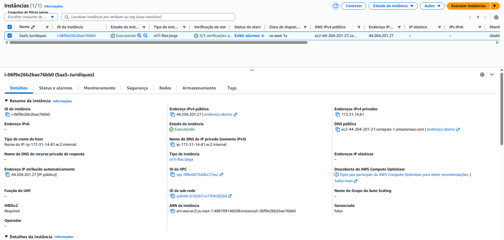
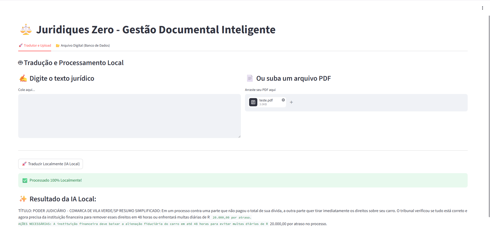
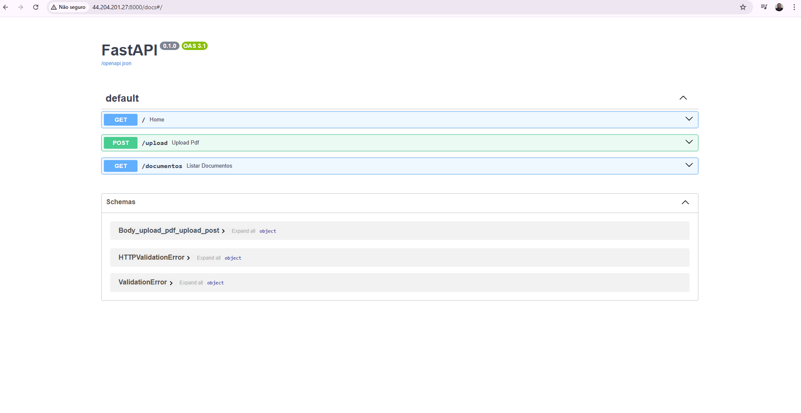
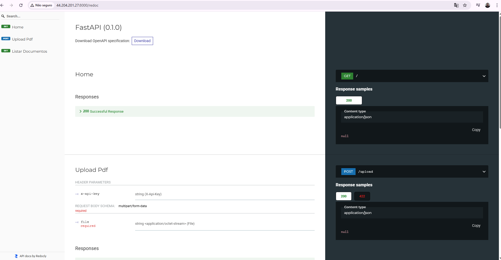
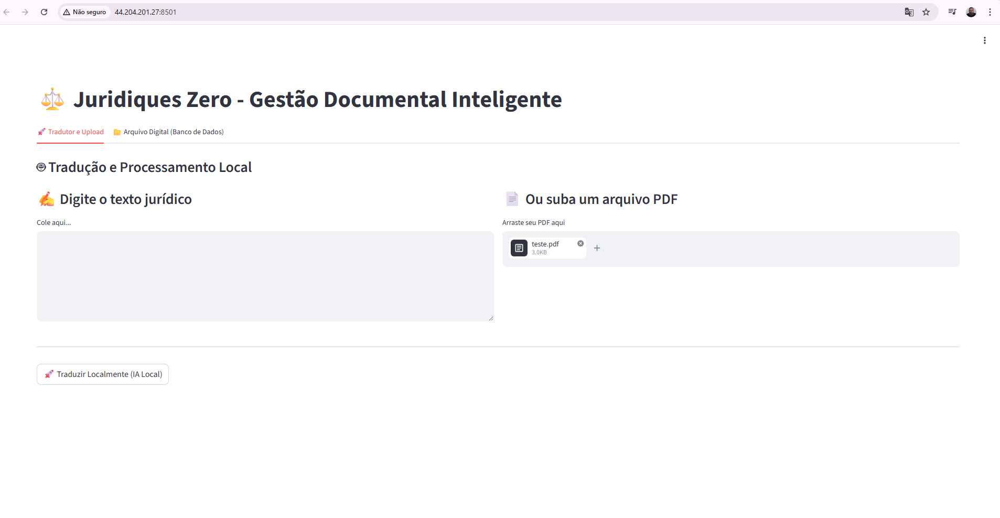
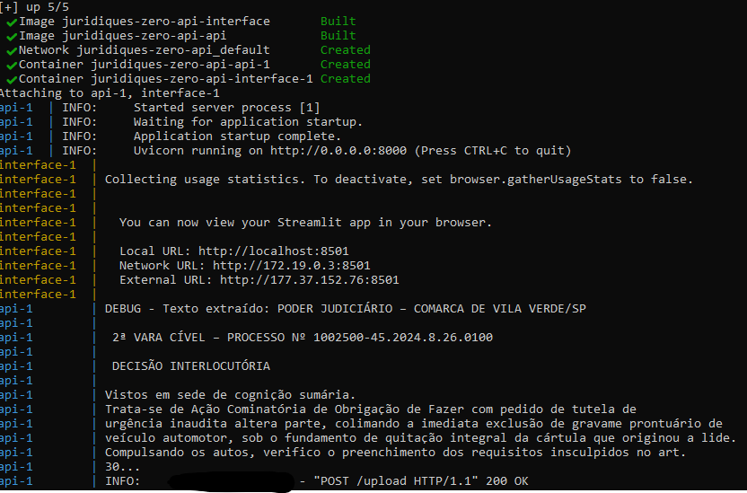

# ⚖️ Juridiques Zero - Inteligência Jurídica Soberana
Soberania Digital e Inteligência Artificial Local para o setor Jurídico.

O Juridiques Zero é um ecossistema de microserviços desenhado para democratizar o entendimento de documentos judiciais. O projeto resolve o problema do "juridiquês" arcaico, permitindo que advogados e cidadãos convertam decisões complexas em linguagem clara de forma 100% privada e offline.

## 🎯 Objetivo e Foco do Projeto
O sistema foca na Gestão de Decisões Judiciais e Liminares. O diferencial é a Privacidade Total: ao utilizar modelos de IA locais, garantimos que dados sensíveis de processos (como nomes de partes e valores de causas) nunca saiam da infraestrutura controlada pelo usuário, respeitando integralmente a LGPD.

## 🏗️ Arquitetura do Sistema (Provisionamento PSC)
Abaixo, detalhamos a infraestrutura conteinerizada que compõe o ecossistema:

1. Orquestração de Microserviços
O sistema utiliza Docker Compose para gerenciar quatro serviços integrados: API (FastAPI), IA Local (Ollama/Llama 3), Banco de Dados (PostgreSQL) e Interface (Streamlit).

2. Rede Interna e Service Discovery
Os contêineres comunicam-se via nomes de serviço, simulando um ambiente real de Data Center, sem exposição desnecessária de portas para o host.

## 🔌 Documentação da API (Swagger)
O projeto conta com documentação interativa automática para testes de endpoints. 👉 Acesse em: http://localhost:8000/docs

## 🚀 Como Executar (Passo a Passo)
1. Clonar o Repositório: git clone https://github.com/Liucera/api-juridiques-zero.git
2. Provisionar a Infraestrutura: docker-compose up -d --build
3. Instalar o Modelo de IA: docker exec -it juridiques-ollama ollama run llama3
4. Acessar o Sistema: Interface (8501) e API Docs (8000/docs)

## 5.0 📸 Demonstração do Ambiente Operacional
O monitoramento via Docker Desktop garante o controle de recursos (CPU/Memória) de cada serviço em tempo real.

## 6.0 📸 Galeria de Implementação e Evidências Técnicas

| 🛡️ Painel AWS EC2 | 🖥️ Interface do Usuário | ⚙️ Swagger API |
| :---: | :---: | :---: |
|  |  |  |

| 📄 Redoc Profissional | ⚖️ Resultado IA |
| :---: | :---: |
|  |  |

## 7.0 Acesso ao Sistema
* Interface: http://44.204.201.27:8501
* API Swagger: http://44.204.201.27:8000/docs
* Redoc: http://44.204.201.27:8000/redoc

---

## 8.0 ⚠️ Ressalvas Técnicas e Conclusões (Normas de Engenharia)

### 1. Gargalos de Hardware e Performance
* **Latência de Inferência:** O processamento via CPU na instância m7i-flex apresenta uma latência média de 4 minutos por documento. É obrigatória a transição para instâncias com GPU para escala comercial.
* **Gerenciamento de Memória:** O modelo Phi-3 exige alta estabilidade de memória RAM (mínimo 4GB exclusivos).

### 2. Escalabilidade e Arquitetura
* **Conformidade de API:** Documentação dupla (Swagger/Redoc) seguindo padrões OpenAPI 3.0.
* **Estratégia Híbrida:** Preparado para IA local (dados sensíveis) e APIs externas (escala).

---

## ⏳ Galeria de Evolução: O Processo de Desenvolvimento
Antes da arquitetura final, o projeto passou por fases de validação fundamentais:

| | | |
| :---: | :---: | :---: |
|  |  |  |
|  |  |  |
|  |  | |

**O que estas imagens representam:**
* Validação de Metadados: Transição da leitura bruta para a extração inteligente.
* Segurança de Header: Implementação da chave de segurança Juridiques2026.
* Logs de Depuração: Monitorização da comunicação entre os microserviços.

**Desenvolvido por Liucera - Aluno do CAPACITA IREDE.**
