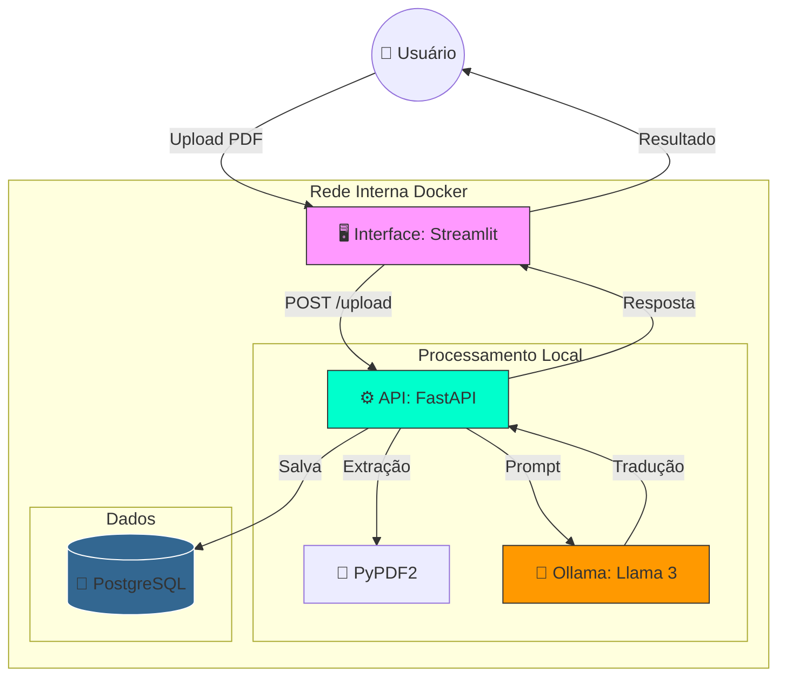

# ⚖️ Juridiques Zero - Inteligência Jurídica Soberana

**Soberania Digital e Inteligência Artificial Local para o setor Jurídico.**

O **Juridiques Zero** é um ecossistema de microserviços desenhado para democratizar o entendimento de documentos judiciais. O projeto resolve o problema do "juridiquês" arcaico, permitindo que advogados e cidadãos convertam decisões complexas em linguagem clara de forma **100% privada e offline**.

---

## 🎯 Objetivo e Foco do Projeto
O sistema foca na **Gestão de Decisões Judiciais e Liminares**. O diferencial é a **Privacidade Total**: ao utilizar modelos de IA locais, garantimos que dados sensíveis de processos (como nomes de partes e valores de causas) nunca saiam da infraestrutura controlada pelo usuário, respeitando integralmente a LGPD.

### Exemplo de Uso Real:
* **Entrada:** Uma decisão técnica da 2ª Vara Cível sobre uma tutela de urgência.
* **Saída:** Identificação automática do prazo (ex: 48h), valor da multa (ex: R$ 20.000,00) e uma explicação simplificada: *"O juiz aceitou o pedido urgente"*.

---

## 🏗️ Arquitetura do Sistema (Provisionamento PSC)

Abaixo, detalhamos a infraestrutura conteinerizada que compõe o ecossistema:

### 1. Orquestração de Microserviços
O sistema utiliza **Docker Compose** para gerenciar quatro serviços integrados:
* **API (FastAPI):** O cérebro logístico. Extrai texto de PDFs via `PyPDF2` e coordena a IA e o banco de dados.
* **IA Local (Ollama/Llama 3):** Processamento de linguagem natural rodando localmente, eliminando custos com APIs externas.
* **Banco de Dados (PostgreSQL):** "Arquivo Digital" persistente que imortaliza cada documento processado.
* **Interface (Streamlit):** Porta de entrada visual para upload e consulta de documentos.

### 2. Rede Interna e Service Discovery
Os contêineres comunicam-se via nomes de serviço (`http://api:8000`), simulando um ambiente real de Data Center, sem exposição desnecessária de portas para o host.

---

## 🔌 Documentação da API (Swagger)
O projeto conta com documentação interativa automática para testes de endpoints.
👉 **Acesse em:** `http://localhost:8000/docs`

---

## 🚀 Como Executar (Passo a Passo)

1. **Clonar o Repositório:**
   ```bash
   git clone [https://github.com/Liucera/API-JURIDIQUES-ZERO.git](https://github.com/Liucera/API-JURIDIQUES-ZERO.git)
   cd API-JURIDIQUES-ZERO

2. Provisionar a Infraestrutura:

Bash
docker-compose up -d --build

3.0 Instalar o Modelo de IA (Obrigatório na primeira execução):

Bash
docker exec -it juridiques-ollama ollama run llama3

4.0 Acessar o Sistema:

Interface: http://localhost:8501

API Docs: http://localhost:8000/docs

5.0 📸 Demonstração do Ambiente Operacional
O monitoramento via Docker Desktop garante o controle de recursos (CPU/Memória) de cada serviço em tempo real.

---

## ⏳ Galeria de Evolução: O Processo de Desenvolvimento

Antes da arquitetura final com IA Local, o projeto passou por fases de validação fundamentais para garantir a precisão da extração e segurança:

<p align="center">
  
  
  
  
  
</p>

### O que estas imagens representam:
* **Validação de Metadados:** Transição da leitura bruta para a extração inteligente.
* **Segurança de Header:** Implementação da chave de segurança `Juridiques2026`.
* **Logs de Depuração:** Monitorização da comunicação entre os microserviços.
## 📊 Fluxo de Arquitetura


